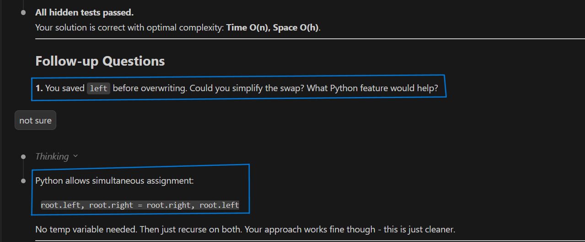
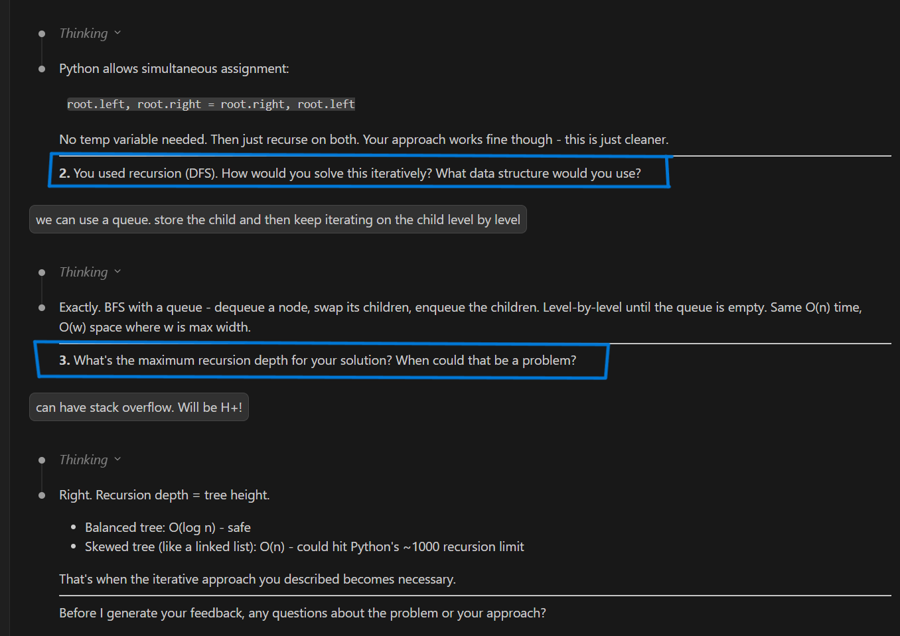
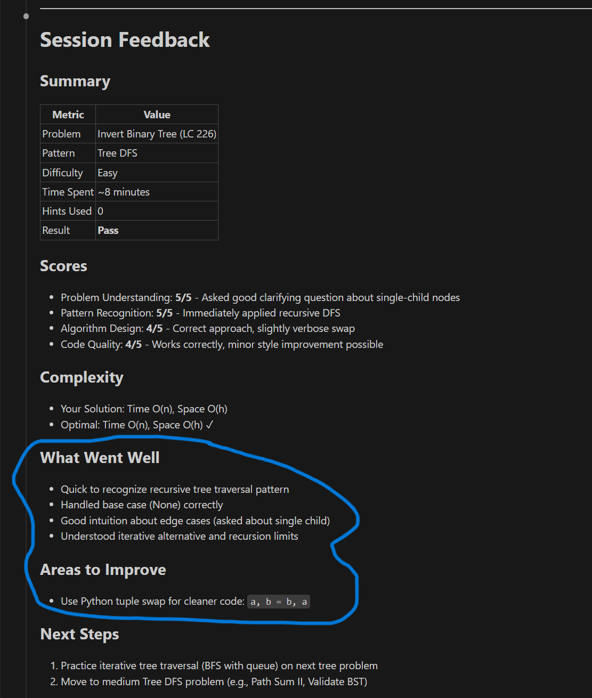
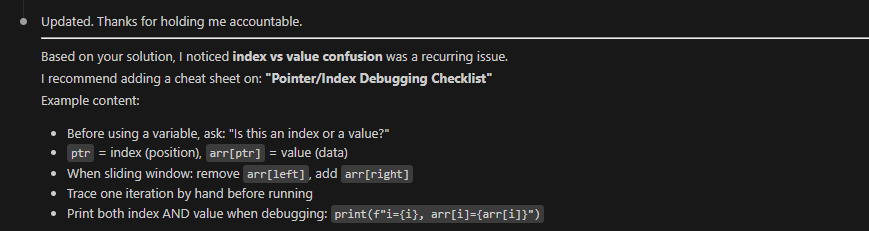

# Coding Interview Prep - Claude Code Skills

AI-powered coding interview practice for [Claude Code](https://claude.ai/claude-code). LeetCode-style problems with follow-ups and detailed feedback.

## Features

- **AI-Generated Questions** - Problems based on 14 common patterns
- **Strict Evaluation** - Pass/fail rubric matches real interview standards
- **Dynamic Follow-ups** - Context-aware questions about your approach
- **Concrete Notes** - Cheat sheets with examples from problems you solved
- **Performance Tracking** - Track progress across patterns
- **Progressive Difficulty** - Unlock harder problems as you improve

## Installation

These skills are markdown instructions that work with any AI coding assistant.

| Tool | Where to paste SKILL.md |
|------|------------------------|
| Claude Code | Auto-detected from `.claude/skills/` |
| Cursor | `.cursorrules` or Project Rules |
| ChatGPT | Custom Instructions or system message |
| Copilot | Chat context or `@workspace` reference |
| Cody | Custom commands |

### Claude Code

**Option 1: Clone the repo (recommended)**

```bash
git clone https://github.com/peppermint-ai-lab/leetcode-skill.git
cd leetcode-skill
code .
```

**Option 2: Add to existing project**

Copy the `skills/` folder to your project's `.claude/skills/` directory:

```bash
cp -r skills/ /path/to/your/project/.claude/skills/
```

Skills are auto-detected. Start with `/interview`.

### Cursor

Cursor uses `.cursorrules` or project rules to customize AI behavior.

**Option 1: Project Rules (recommended)**

1. Open Cursor Settings → Rules → Project Rules
2. Create a new rule and paste the contents of `SKILL.md`
3. Set the rule to apply to your workspace

**Option 2: .cursorrules file**

```bash
# Copy the interview skill to .cursorrules
cat .claude/skills/interview/SKILL.md > .cursorrules
```

Then start a session by typing:
```
/interview sliding window
```

### ChatGPT / Codex

Use the skill as a system prompt or custom instructions.

1. Copy the contents of `.claude/skills/interview/SKILL.md`
2. Paste into ChatGPT's "Custom Instructions" or as the first message
3. Start with: "Let's practice sliding window problems"

**Tip:** Also include the feedback rubric (`references/feedback-rubric.md`) for strict evaluation.

### GitHub Copilot Chat

1. Open the skill file in your editor
2. Select all content and use "Add to Chat Context"
3. Or reference it: `@workspace /interview sliding window`

### Other Tools

The `SKILL.md` files are self-contained prompts. For any AI tool:

1. **Find the skill:** `.claude/skills/{skill-name}/SKILL.md`
2. **Include references:** Also include files in `references/` folder
3. **Provide context:** Share your `user-profile.md` for personalized difficulty
4. **Start the session:** Use the trigger phrase (e.g., `/interview`)

## Usage

### Start a Practice Session

```bash
/interview                    # Random problem
/interview sliding window     # Specific pattern
/interview two sum            # Specific problem
/interview --next             # Focus on weak areas
/interview --profile          # View/edit settings
```

### During the Session

1. **Solve** - Implement in `solution.py`
2. **Test** - Say "run" to test your solution
3. **Submit** - Say "submit" when ready for evaluation
4. **Follow-ups** - Answer questions about your approach

### Example: Suggestions on Language

During followup the AI will guide you to simplify your code using language semantics:



### Example: Follow-up Questions

After solving, expect questions about your approach:



### Example: Feedback

Get detailed feedback with pass/fail per dimension:



### Example: Cheat Sheet Recommendations

Based on your mistakes, get personalized cheat sheets:



## Other Skills

### Focus Mode

Disable AI autocomplete for authentic practice:

```bash
/focus-mode on      # Disable autocomplete
/focus-mode off     # Restore settings
/focus-mode status  # Check current state
```

### Study Dashboard

Track overall progress and get recommendations:

```bash
/studykit                           # Show dashboard
/studykit --target Google SWE       # Set job target
/studykit --suggest                 # Get recommendations
```

## Customizing Skills

Skills are defined in `SKILL.md` files inside each skill folder. You can modify them to fit your needs.

### Skill Structure

```
.claude/skills/
├── interview/
│   ├── SKILL.md              # Main skill definition
│   └── references/
│       ├── feedback-rubric.md    # Evaluation criteria
│       └── hidden-test-guidance.md
├── studykit-manager/
│   └── SKILL.md
└── focus-mode/
    └── SKILL.md
```

### Example: Changing the Feedback Rubric

Edit `.claude/skills/interview/references/feedback-rubric.md` to adjust how strictly you're evaluated.

### Example: Changing Note Style

The skill instructions tell Claude how to write notes. In `interview/SKILL.md`, Phase 7 defines the note-writing style:

```markdown
**Writing Style for Notes:**
- Use **concrete examples from the problem just solved**, not abstract explanations
- Show the actual array/input from the problem when illustrating concepts
- Include visual diagrams using ASCII when helpful
```

### Adding New Patterns

Edit the pattern list in `interview/SKILL.md` and update `.interview/user-profile.md` to include new patterns in the progress table.

## Directory Structure

```
├── .claude/skills/          # Skill definitions (customize these)
│   ├── interview/
│   ├── studykit-manager/
│   └── focus-mode/
├── .interview/              # Runtime data (auto-generated)
│   ├── user-profile.md      # Your settings and progress
│   ├── notes/               # Your cheat sheets
│   └── performance/         # Session history and stats
├── screenshots/             # Example images for README
└── solution.py              # Your solution file
```

## The 14 Patterns

| Pattern | Use When |
|---------|----------|
| Sliding Window | Contiguous subarray problems |
| Two Pointers | Sorted arrays, pair finding |
| Fast & Slow Pointers | Cycle detection |
| Merge Intervals | Overlapping intervals |
| Cyclic Sort | Arrays with numbers 1-n |
| In-place Linked List Reversal | Reverse without extra space |
| Tree BFS | Level-order traversal |
| Tree DFS | Path problems |
| Two Heaps | Median finding |
| Subsets | Combinations, permutations |
| Modified Binary Search | Rotated arrays |
| Top K Elements | K largest/smallest |
| K-way Merge | Merge sorted lists |
| Topological Sort | Task ordering |

## Requirements

- Any AI coding assistant (Claude Code, Cursor, ChatGPT, Copilot, etc.)
- Python 3.x

## License

MIT
